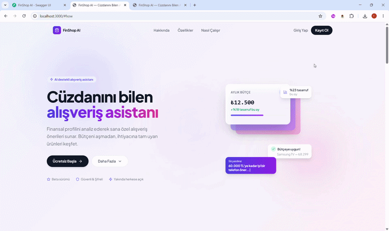
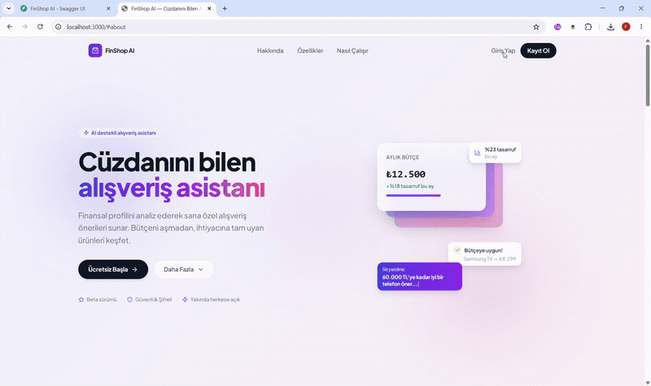
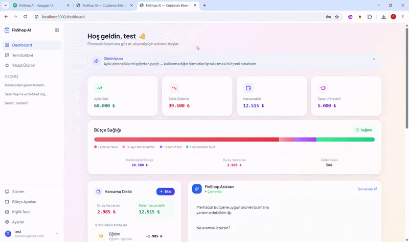
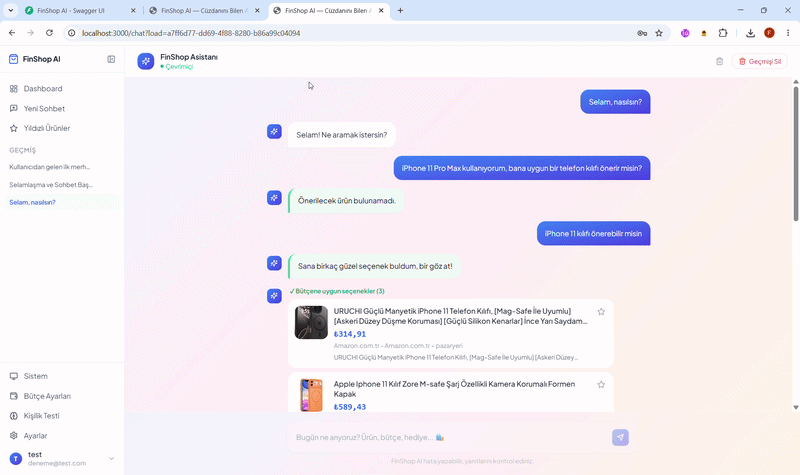

# 🛒 FinShop AI

## "The Smart Shopping Assistant That Knows Your Wallet"

FinShop AI is an intelligent shopping and budget management platform based on a **multi-agent AI architecture** that innovatively combines financial (FinTech) and e-commerce themes.

The platform offers a personalized shopping experience by analyzing users' spending habits, personality traits, and real-time budget status. Unlike traditional e-commerce platforms, FinShop AI does not aim to make users "spend more," but rather to make them "spend smarter and budget-friendly."

---

## 🚀 Project Goal and Vision

Today, users often exceed their budgets and make impulsive purchases due to the encouraging structure of e-commerce sites. FinShop AI solves this problem by:
- Analyzing the user's budget and spending habits.
- Determining the user's spending profile (impulsive, balanced, frugal, etc.) with a custom "Personality Test."
- Conducting a natural dialogue with the user through advanced AI agents and offering personalized, price-performance-oriented product recommendations.

---

## 🧠 Advanced Agentic AI Architecture

At the heart of the system lies a complex Multi-Agent system powered by Google Gemini, orchestrated with **LangChain** and **LangGraph**. Each agent functions in a specific area of expertise and works in perfect harmony:

- 🧱 **Base Agent:** The abstract base class inherited by all agents. It provides the infrastructure for LLM calls, logging, timing, and error handling.
- 👮 **Security Agent:** Inspects user inputs, protecting the system against prompt injection and harmful content.
- 🗣️ **Conversation Agent:** Conducts a natural, empathetic, and context-aware dialogue with the user.
- 🕵️ **Search Agent:** Conducts instant and highly accurate product research on the internet using tools like SerpApi.
- 🧠 **Personality Agent:** Analyzes spending psychology based on the user's personality type.
- 💰 **Budget Agent:** Tracks the user's financial status and ensures product recommendations remain within budget limits.
- 🎯 **Recommendation Agent:** Determines the ideal products by blending search results, budget constraints, and the user profile.
- ⚖️ **Review Agent:** Evaluates the quality, user reviews, and price-performance ratio of the products to be recommended.
- ⭐ **Watchlist Agent:** Manages the products the user is interested in or has favorited.
- 🎼 **Orchestrator:** The main controller that manages the data flow, decision mechanisms, and task sequencing between all these agents.

---

## 🏗️ Technologies Used

The project is built using modern, high-performance, and scalable technologies:

### 🎨 Frontend
- **Framework:** Next.js 14 (App Router)
- **Library:** React 18, TypeScript
- **Styling & UI:** Tailwind CSS 3, Framer Motion, lucide-react
- **Charts & Data Visualization:** Recharts
- **Multi-language (i18n):** i18next, react-i18next

### ⚙️ Backend
- **Framework:** FastAPI (Python)
- **Database:** Supabase (PostgreSQL)
- **AI & LLM:** Google Gemini API, LangChain, LangGraph, Manus API
- **Search Engine Integration:** SerpApi (google-search-results)
- **Security & Auth:** JWT Authentication, passlib, python-jose, slowapi

---

## 📂 Project Structure

```bash
FinShop-AI/
│
├── backend/                        # FastAPI-based asynchronous backend services
│   ├── app/                        # Main application core
│   │   ├── agents/                 # 🤖 AI Agent Layer (base_agent + 9 specialized agents)
│   │   ├── api/                    # REST API Endpoints
│   │   │   └── routes/             # Route definitions (auth, chat, budget, etc.)
│   │   ├── core/                   # Configuration, security, and logging
│   │   ├── models/                 # Pydantic data models
│   │   ├── prompts/                # AI system prompts
│   │   └── services/               # Business logic services
│   │       └── llm/                # LLM Clients (Gemini, Manus)
│   ├── scripts/                    # Automation scripts and seed scripts
│   ├── tests/                      # Unit and integration tests
│   ├── logs/                       # Application logs
│   ├── requirements.txt            # Python dependencies
│   └── *_schema.sql                # Database schemas (Supabase, Watchlist, Security Logs)
│
├── frontend/                       # Next.js 14-based modern web interface
│   ├── app/                        # Next.js App Router
│   │   ├── login/                  # Login page
│   │   ├── register/               # Register page
│   │   ├── onboarding/             # User onboarding flow
│   │   │   ├── personality/        # Personality test
│   │   │   └── budget/             # Budget information input
│   │   ├── dashboard/              # Main control dashboard
│   │   │   └── components/         # Dashboard components (10 components)
│   │   ├── chat/                   # AI Shopping Assistant
│   │   │   └── history/            # Past chats
│   │   ├── watchlist/              # Favorited / tracked products
│   │   ├── settings/               # Settings
│   │   │   └── account/            # Account settings
│   │   └── support/                # Support page
│   ├── hooks/                      # Custom React Hooks
│   ├── lib/                        # API connections, i18n, and utility tools
│   └── types/                      # TypeScript type definitions
│
├── Images/                         # Project images and presentation materials
├── .gitignore                      # Files to be ignored by Git
└── readme.md                       # Project introduction and installation guide
```

---

## ⚙️ Installation and Running

You can follow the steps below to run the project in your local environment.

### 1️⃣ Clone the Project

```bash
git clone <repo-link>
cd FinShop-AI
```

### 2️⃣ Backend Installation

To run the backend, you must create your `.env` file and enter your API keys (Gemini, Supabase, etc.).

```bash
cd backend
python -m venv venv
source venv/bin/activate  # On Windows use: venv\Scripts\activate
pip install -r requirements.txt

# Configure environment variables (create backend/.env file)
# GEMINI_API_KEY=...
# SUPABASE_URL=...
# SUPABASE_KEY=...
# JWT_SECRET_KEY=...
# MANUS_API_KEY=...
# SERPAPI_KEY=...

# Start the server
uvicorn app.main:app --reload
```

### 3️⃣ Frontend Installation

Open a new terminal and navigate to the frontend folder. You also need to create a `.env.local` file for the frontend.

```bash
cd frontend

# Create environment variable
echo NEXT_PUBLIC_API_URL=http://localhost:8000 > .env.local

# Install dependencies
npm install

# Start the development server
npm run dev
```
By running the backend and frontend in two separate terminals, you can test our project at http://localhost:3000.

---

## 📸 Project Images and Runtime Flows

The live working flows of the project's core modules, user interface interactions, and AI agent integrations are detailed below:

### 🌐 1. Platform Vision and "How It Works" Flow
A modern, animated Landing Page interface greeting the user. This flow demonstrates the platform's core philosophy, the solutions it offers, the project execution steps, and the first interaction layer preparing the user for financial awareness.



### 🔐 2. Secure Authentication and Registration Flow
Secure authentication (Authentication) architecture based on JWT (JSON Web Token) designed using Supabase infrastructure. Interface simulation of the user registering for the first time and starting a secure session.



### 📊 3. Dynamic Dashboard and Proactive Budget Analysis
The moment the Next.js dashboard loads asynchronously after logging into the system. Listing the user's real-time budget cards fetched from Supabase, spending limits, financial profile analyzed by AI such as "Frugal Spender", and proactive savings suggestions.



### 🤖 4. Multi-Agent System and Smart Shopping Chat
Smart phone and case search scenario based on the user's budget. The process where the input passes through the `SecurityAgent` filter, gets processed by the `ConversationAgent`, and price-performance or alternative product cards are dynamically rendered on the screen within seconds according to budget limits. Subsequently, the workflow of the "Starred Products" (Watchlist) module is shown.




## 👥 Team and Task Distribution

This project was developed by a 3-person team, with each member taking an active role in both frontend and backend development:

- **Member 1:**
  - **Frontend:** Navbar, Sidebar, QuickActions, Dashboard layout, general UI/UX design
  - **Backend:** Search Agent, Conversation Agent, Orchestrator

- **Member 2:**
  - **Frontend:** BudgetCards, ExpenseTracker, AddExpenseModal
  - **Backend:** Budget Agent, Personality Agent, Recommendation Agent, Supabase schema design

- **Member 3:**
  - **Frontend:** SavingsTips, ChatPreview, WishlistWidget, DailyTip, Watchlist page
  - **Backend:** Watchlist Agent, Review Agent, Security Agent, Manus API integration

---

## 🎯 Competition Theme and Goals

**FinShop AI** is designed within the scope of the Finance and E-Commerce themed competition to achieve the following goals:
1. Building financial awareness and budget discipline in users.
2. Offering a pinpoint shopping experience by filtering information pollution on the internet through agents.
3. Combining e-commerce with an AI-supported financial consultancy process.

---

## 💌 User Credentials for Testing

- **Email:** deneme@test.com
- **Password:** test1234
  
---

## 📄 License

> [!WARNING]
> **Legal Notice:** Developed for a hackathon. All rights reserved. Unauthorized copying, distribution, or usage is prohibited.

---

<div align="center">
  <b>FinShop AI</b><br>
  <i>"The Smart Shopping Assistant That Knows Your Wallet"</i>
</div>
